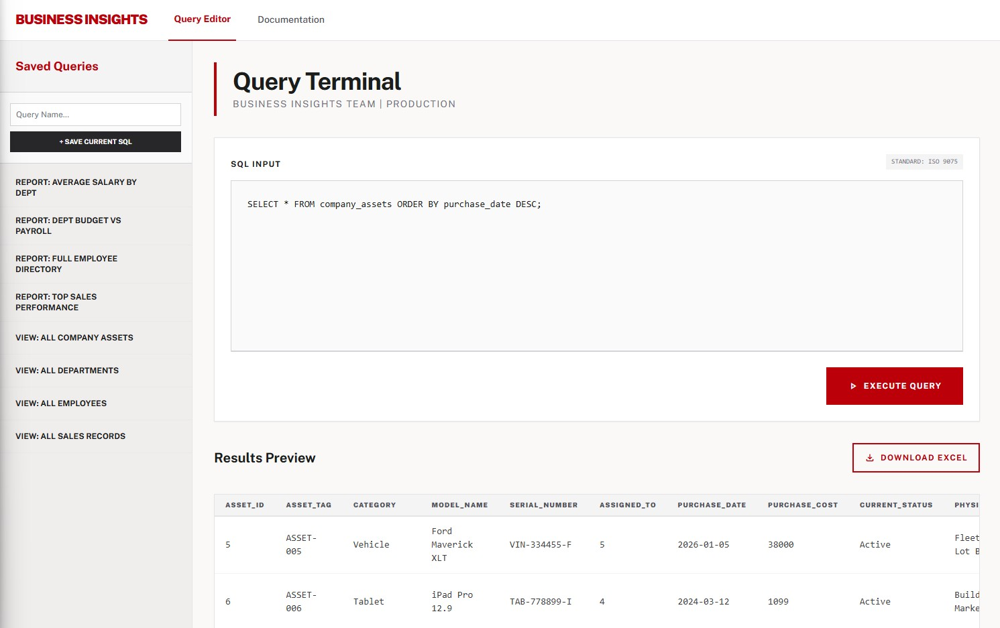
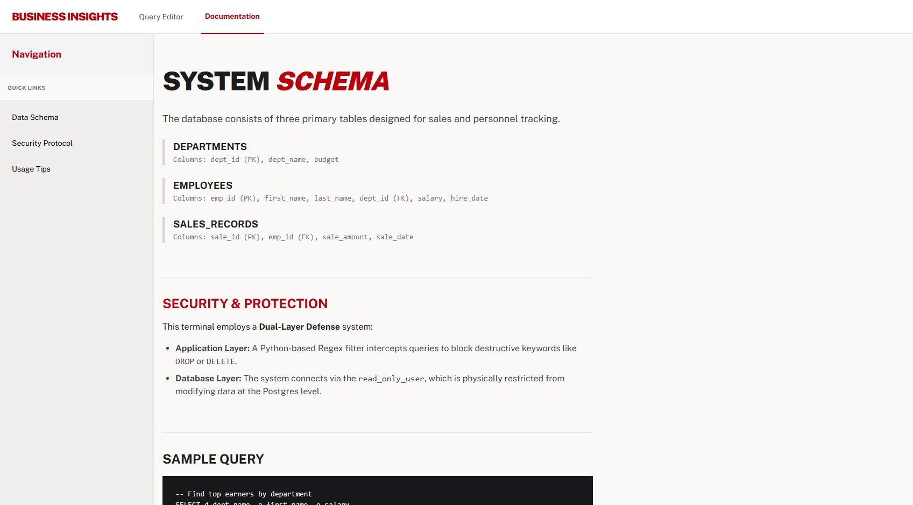

#  SQL Query Terminal

This project is a high-security SQL query and reporting tool. It is designed with a dual-layer defense: a Python-based regex filter and a database-level read-only user.

## 🖼️ Visual Overview

| Main Query Terminal | System Documentation |
| :--- | :--- |
|  |  |
| *The primary interface for executing read-only SQL queries with real-time regex filtering.* | *Detailed internal documentation accessible to authorized administrative users.* |

## 🚀 Deployment Checklist

### 1. Code Adjustments (`app.py`)
* **Route Ordering:** The `app.mount("/", ...)` command MUST remain at the absolute bottom of the file to ensure API routes (`/api/...`) are evaluated first.
* **CORS Lockdown:** Replace `allow_origins=["*"]` with the specific internal DNS name or URL of your ELB.
* **Static Files:** Ensure the path in `StaticFiles(directory="../frontend")` correctly points to your frontend folder relative to the execution directory.

### 2. Database & Security
* **Secrets Management:** Integrate with your cloud provider's Secrets Manager. Replace hardcoded dictionaries (`READONLY_CONFIG` and `ADMIN_CONFIG`) with logic that fetches the rotated password and hostname at runtime.
* **Postgres Lockdown:** Update `pg_hba.conf` to ensure the database only accepts local connections, preventing any bypass of the application logic.

### 3. Process Management
* **Disable Dev Mode:** Ensure the `--reload` flag is removed from the startup command.
* **Systemd Service:** Create a service file to ensure the app starts on boot and restarts after crashes.

---

## 🛠️ Systemd Service Template

Create the file `/etc/systemd/system/insights.service`:

```ini
[Unit]
Description=Business Insights FastAPI Server
# Wait for the network and local database to be ready
After=network.target postgresql.service

[Service]
User=linux_service_user
Group=www-data
WorkingDirectory=/opt/business-insights/backend
# Bind to 0.0.0.0 so the ELB can reach the service
ExecStart=/usr/local/bin/gunicorn app:app -w 4 -k uvicorn.workers.UvicornWorker -b 0.0.0.0:8000
Restart=always
RestartSec=5

[Install]
WantedBy=multi-user.target
